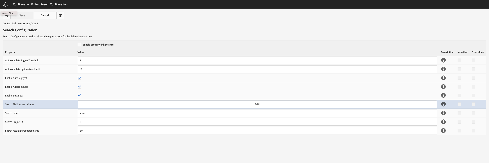

# AEM Module to integrate Valtech's Search as a Service

[](https://sonarcloud.io/dashboard?id=valtech-ch_saas-aem-module)

AEM Search Module to use and customize Valtech's Search as a Service (SAAS) offering within AEM.


- [About Search as a Service](#about-search-as-a-service)
- [AEM Search Module](#aem-search-module)
- [Features](#features)
  - [Components](#components)
  - [AEM APIs](#aem-apis)
  - [Configurations](#configurations)
    - [OSGi configurations](#osgi-configurations)
    - [Context Aware configurations](#context-aware-configurations)
- [System Requirements](#system-requirements)
- [Installation](#installation)
  - [Clientlibs](#clientlibs)
  - [Embedding in a maven project](#embedding-in-a-maven-project)
    - [Step 1: Add SaaS as a dependency](#step-1-add-saas-as-a-dependency)
    - [Step 2: Add SaaS as an embed package](#step-2-add-saas-as-an-embed-package)
  - [Uninstall](#uninstall)
  - [Rendering](#rendering)
- [License](#license)
- [Developers](#developers)

# About Search as a Service

Search as a Service (SAAS) is continuously improved by Valtech Switzerland in cooperation with its clients. This service
allows Valtech clients to jointly benefit from a constantly evolving and improved search service for digital experience
platforms. Improvements are continuously rolled out as updates become available without any downtime. The offering
consists of the following main components:

* SAAS Crawler - Web page crawling, extraction of relevant content areas, and metadata.
* SAAS Administration UI - Interface for controlling and configuring the crawlers.
* SAAS Engine - Collection of APIs for full text or typeahead content queries.
* SAAS AEM Module - this module has been designed to easily integrate SAAS into AEM within a very short timeframe through
  configuration and styling


# AEM Search Module

The AEM Search Module can be installed and connected to SAAS through configuration. Content Authors then configure
content pages that act as Search Result Pages (SERP). The author configures the behaviour like filters or tabs according
to the specific needs of the SERP.

On top of that, AEM developers can extend the AEM Search Component to implement custom requirements that are not covered
out-of-the-box. The component follows the architectural patterns of [AEM WCM Core Components](https://github.com/adobe/aem-core-wcm-components) . Therefore, the approach is
known and straight forward to extend while ensuring maintainability of the core module. In the SAAS Administration UI
the SAAS Crawler can be configured. A recommended approach is to use Sitemaps (although raw crawling works as well) in
order to indicate which pages should be shown in the Search Admin. To generate Sitemaps, the Apache Sling Sitemap module
can be used described on the AEM
documentation: https://experienceleague.adobe.com/docs/experience-manager-cloud-service/overview/seo-and-url-management.html?lang=en#building-an-xml-sitemap-on-aem

# Features

- **Production-Ready:** Ready made APIs and components that are well tested and used in Production.
- **Cloud-Ready:** Whether on AEM as a Cloud Service, on Adobe Managed Services, or on-premise, they just work.
- **Customizable** Modules are designed to be customized: API module with interfaces, components can be changed similar to AEM core components, modules published on maven central and npm registry.  
- **Themeable:** The components markup follows BEM CSS conventions and are prefixed to avoid any integration conflicts.
- **Configurable:** Features can be configured on component and on context aware-level.
- **WebApp-Ready:** The streamlined JSON output allows client-side rendering.
- **Developer friendly:** Intensive documentation in readme files, javadocs and sample code.
- **Open Sourced:** If something is not as it should, contribution is welcomed.

## Components

* [Search Redirect](ui.apps/src/main/content/jcr_root/apps/saas-aem-module/components/searchredirect/README.md)
* [Search](ui.apps/src/main/content/jcr_root/apps/saas-aem-module/components/search/README.md)
* [Search Tab](ui.apps/src/main/content/jcr_root/apps/saas-aem-module/components/searchtab/README.md)

**Component group:** _Search as a Service - Content_

## AEM APIs

AEM APIs are interfaces exported by `saas-aem.api` module, that provide consumption of SaaS REST APIs.
The `saas-aem.core` module offers a default implementation for each of these interfaces. However, client projects
utilizing the module have the possibility to provide a custom implementation by specifying a higher `service.ranking`
property and implementing the interface accordingly.

| Interface | Default implementation in `saas-aem.core` |
| --- | ---: |
|[FulltextSearchService](api/src/main/java/com/valtech/aem/saas/api/fulltextsearch/FulltextSearchService.java) | [DefaultFulltextSearchService](core/src/main/java/com/valtech/aem/saas/core/fulltextsearch/DefaultFulltextSearchService.java) |
|[TypeaheadService](api/src/main/java/com/valtech/aem/saas/api/autocomplete/TypeaheadService.java) | [DefaultTypeaheadService](core/src/main/java/com/valtech/aem/saas/core/typeahead/DefaultTypeaheadService.java) |
|[BestBetsService](api/src/main/java/com/valtech/aem/saas/api/bestbets/BestBetsService.java) | [DefaultBestBetsService](core/src/main/java/com/valtech/aem/saas/core/bestbets/DefaultBestBetsService.java) |
|[IndexUpdateService](api/src/main/java/com/valtech/aem/saas/api/indexing/IndexUpdateService.java) | [DefaultIndexUpdateService](core/src/main/java/com/valtech/aem/saas/core/indexing/DefaultIndexUpdateService.java) |

## Configurations

Configurations are split in OSGi and Context-Aware.

### OSGi configurations

1. [Search as a Service - Search Service HTTP Connection Configuration](http://localhost:4502/system/console/configMgr/com.valtech.aem.saas.core.http.client.DefaultSearchServiceConnectionConfigurationService)
2. [Search as a Service - Fulltext Search Service Configuration](http://localhost:4502/system/console/configMgr/com.valtech.aem.saas.core.fulltextsearch.DefaultFulltextSearchService)
3. [Search as a Service - Autocomplete Service Configuration](http://localhost:4502/system/console/configMgr/com.valtech.aem.saas.core.autocomplete.DefaultAutocompleteService)
4. [Search as a Service - Best Bets Service Configuration](http://localhost:4502/system/console/configMgr/com.valtech.aem.saas.core.bestbets.DefaultBestBetsService)
5. [Search as a Service - Index Update Service Configuration](http://localhost:4502/system/console/configMgr/com.valtech.aem.saas.core.indexing.DefaultIndexUpdateService)
6. [Search as a Service - Search Admin Request Executor Service Configuration](http://localhost:4502/system/console/configMgr/com.valtech.aem.saas.core.http.client.DefaultSearchAdminRequestExecutorService)
7. [Search as a Service - Search Api Request Executor Service Configuration](http://localhost:4502/system/console/configMgr/com.valtech.aem.saas.core.http.client.DefaultSearchApiRequestExecutorService)

### Context Aware configurations

| Label                            | Name                         | Description                                                                                                                | Required |
|----------------------------------|:-----------------------------|:---------------------------------------------------------------------------------------------------------------------------|:--------:|
| Search Index                     | index                        | Index defined in SaaS admin                                                                                                |    x     |
| Search Project Id                | projectId                    | Project identifier defined in SaaS admin                                                                                   |    x     |
| Search Filters                   | searchFilters                | Key/value pairs of **field name** and **value**                                                                            |          |
| Search result highlight tag name | highlightTagName             | The name of the tag that will be used to highlight portions of text in the search results. (Optional; Default value: `em`) |          |
| Enable Best Bets                 | enableBestBets               | Flag that enables displaying best bets on the top of the search results. Defaults to `false`                               |          |
| Enable Auto Suggest              | enableAutoSuggest            | Flag that enables auto suggest feature in the search component. Defaults to `true`                                         |          |
| Enable Autocomplete              | enableAutocomplete           | Flag that enables autocomplete feature in the search input. Defaults to `true`                                             |          |
| Autocomplete Trigger Threshold   | autocompleteTriggerThreshold | The minimum number of search input characters required for displaying autocomplete options.                                |          |
| Autocomplete options Max Limit   | autocompleteOptionsMax       | The maximum number of autocomplete options displayed.                                                                      |          |



# System Requirements

| AEM 6.5 | AEM as a Cloud Service | JDK | Maven |
| --- | --- | --- | --- |
| 6.5.10.0+ (*) | Continual | 8, 11 | 3.3.9+ |

# Installation

You can download the packages and bundles from [Maven Central](https://repo1.maven.org/maven2/io/github/valtech-ch/saas-aem/).

## Clientlibs

To use the Search components, the following client libraries should be included:

* [saas-aem-module.base](ui.apps/src/main/content/jcr_root/apps/saas-aem-module/clientlibs/clientlib-base)

Add them as entries in the multifield _**Client Libraries JavaScript Page Head**_, in the page policy for the editable
template where the components would be used.

To see a styling sample based on WKND theme, the following client library should be included (NOT RECOMMENDED FOR PRODUCTION):

* [saas-aem-module.wknd-sample](ui.apps/src/main/content/jcr_root/apps/saas-aem-module/clientlibs/wknd-sample)

To read more information about how to style, [here](ui.frontend/src/main/webpack/site/styles/wkndsample/README.md)

## Embedding in a maven project

If your project has similar structure to an aem archetype generated project, then update the pom.xml of your
project's **all** module. Whether you choose all modules or partial modules, add the appropriate
dependencies and configure the **filevault-package-maven-plugin** plugin accordingly to embedd them.

### Step 1: Add SaaS as a dependency

In the <dependencies> section of your all project’s pom.xml file, add this:

```xml

<dependency>
  <groupId>io.github.valtech-ch</groupId>
  <artifactId>saas-aem.all</artifactId>
  <version>${saas.version}</version>
</dependency>
```

### Step 2: Add SaaS as an embed package

In the filevault-package-maven-plugin plugin configuration of your all project’s pom.xml file, add this:

```xml

<embeddeds>
  <embedded>
    <groupId>io.github.valtech-ch</groupId>
    <artifactId>saas-aem.all</artifactId>
    <type>zip</type>
    <target>/apps/vendor-packages/container/install</target>
  </embedded>
  ...
</embeddeds>
```

## Uninstall

To uninstall the module, delete the following subtrees:

* /apps/saas-aem-module
* /apps/saas-aem-module-packages
* /home/users/system/saas

## Rendering

As the search components are highly dynamic, rendering is  completely done in the frontend. 
Within the HTL only a webcomponent with the api-endpoint and configuration is exported. 
The HTL script is only rendering a placeholder in **wcmmode = edit**. 
The components are utilizing `org.apache.sling.models.jacksonexporter` to export the
sling model into json. The exported json is then consumed by the FE and the actual component markup is generated.

# License

The SaaS AEM module is licensed under the [MIT LICENSE](LICENSE).

# Developers

See our [developer zone](docs/developers.md).
