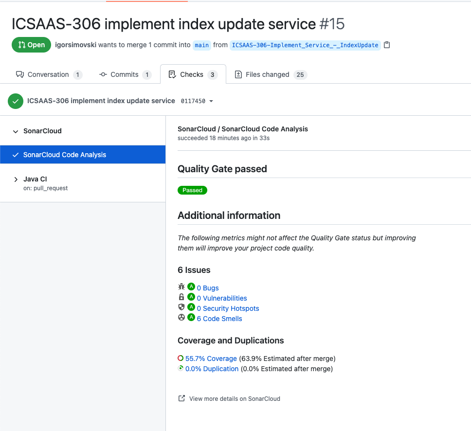

# AEM Module to integrate Valtech's Search as a Service

## Introduction
SAAS (Search as a Service) is continuously improved by Valtech Switzerland in cooperation with its clients. This service allows Valtech clients to jointly benefit from a constantly evolving and improved search service for digital experience platforms. Improvements are continuously rolled out as updates become available without any downtime. The offering consists of the following main components:

* SAAS Crawler - Web page crawling, extraction of relevant content areas, and metadata.
* SAAS Administration UI - Interface for controlling and configuring the crawlers.
* SAAS Engine - Collection of APIs for full text or typeahead content queries.
* SAAS AEM Search Component - this very component for integrating SAAS into AEM within a very short timeframe through configuration and styling

## Approach
The AEM Search Component can be installed and connected to SAAS through configuration. Content Authors then configure content pages that act as Search Result Pages (SERP). The author configures the behaviour like filters or tabs according to the specific needs of the SERP.

On top of that, AEM developers can extend the AEM Search Component to implement custom requirements that are not covered out-of-the-box. The component follows the architectural patterns of Adobe Core Component. Therefore, the approach is known and straight forward to extend while ensuring maintainability of the core module.
In the SAAS Administration UI the SAAS Crawler can be configured. A recommended approach is to use Sitemaps (although raw crawling works as well) in order to indicate which pages should be shown in the Search Admin. To generate Sitemaps, AEM Core components can be used: https://experienceleague.adobe.com/docs/experience-manager-cloud-service/overview/seo-and-url-management.html?lang=en#building-an-xml-sitemap-on-aem 

## Modules

The main parts of the template are:

* core: Java bundle containing all core functionality like OSGi services, listeners or schedulers, as well as component-related Java code such as servlets or request filters.
* it.tests: Java based integration tests
* ui.apps: contains the /apps (and /etc) parts of the project, ie JS&CSS clientlibs, components, and templates
* ui.content: contains sample content using the components from the ui.apps
* ui.config: contains runmode specific OSGi configs for the project
* ui.frontend: an optional dedicated front-end build mechanism (Angular, React or general Webpack project)
* ui.tests: Selenium based UI tests
* all: a single content package that embeds all of the compiled modules (bundles and content packages) including any vendor dependencies
* analyse: this module runs analysis on the project which provides additional validation for deploying into AEMaaCS

## How to build

To build all the modules run in the project root directory the following command with Maven 3:

    mvn clean install

To build all the modules and deploy the `all` package to a local instance of AEM, run in the project root directory the following command:

    mvn clean install -PautoInstallSinglePackage

Or to deploy it to a publish instance, run

    mvn clean install -PautoInstallSinglePackagePublish

Or alternatively

    mvn clean install -PautoInstallSinglePackage -Daem.port=4503

Or to deploy only the bundle to the author, run

    mvn clean install -PautoInstallBundle

Or to deploy only a single content package, run in the sub-module directory (i.e `ui.apps`)

    mvn clean install -PautoInstallPackage

## Testing

There are three levels of testing contained in the project:

### Unit tests

This show-cases classic unit testing of the code contained in the bundle. To
test, execute:

    mvn clean test

### Integration tests

This allows running integration tests that exercise the capabilities of AEM via
HTTP calls to its API. To run the integration tests, run:

    mvn clean verify -Plocal

Test classes must be saved in the `src/main/java` directory (or any of its
subdirectories), and must be contained in files matching the pattern `*IT.java`.

The configuration provides sensible defaults for a typical local installation of
AEM. If you want to point the integration tests to different AEM author and
publish instances, you can use the following system properties via Maven's `-D`
flag.

| Property | Description | Default value |
| --- | --- | --- |
| `it.author.url` | URL of the author instance | `http://localhost:4502` |
| `it.author.user` | Admin user for the author instance | `admin` |
| `it.author.password` | Password of the admin user for the author instance | `admin` |
| `it.publish.url` | URL of the publish instance | `http://localhost:4503` |
| `it.publish.user` | Admin user for the publish instance | `admin` |
| `it.publish.password` | Password of the admin user for the publish instance | `admin` |

The integration tests in this archetype use the [AEM Testing
Clients](https://github.com/adobe/aem-testing-clients) and showcase some
recommended [best
practices](https://github.com/adobe/aem-testing-clients/wiki/Best-practices) to
be put in use when writing integration tests for AEM.

## Static Analysis

The `analyse` module performs static analysis on the project for deploying into AEMaaCS. It is automatically
run when executing

    mvn clean install

from the project root directory. Additional information about this analysis and how to further configure it
can be found here https://github.com/adobe/aemanalyser-maven-plugin

### UI tests

They will test the UI layer of your AEM application using Selenium technology. 

To run them locally:

    mvn clean verify -Pui-tests-local-execution

This default command requires:
* an AEM author instance available at http://localhost:4502 (with the whole project built and deployed on it, see `How to build` section above)
* Chrome browser installed at default location

Check README file in `ui.tests` module for more details.

## ClientLibs

The frontend module is made available using an [AEM ClientLib](https://helpx.adobe.com/experience-manager/6-5/sites/developing/using/clientlibs.html). When executing the NPM build script, the app is built and the [`aem-clientlib-generator`](https://github.com/wcm-io-frontend/aem-clientlib-generator) package takes the resulting build output and transforms it into such a ClientLib.

A ClientLib will consist of the following files and directories:

- `css/`: CSS files which can be requested in the HTML
- `css.txt` (tells AEM the order and names of files in `css/` so they can be merged)
- `js/`: JavaScript files which can be requested in the HTML
- `js.txt` (tells AEM the order and names of files in `js/` so they can be merged
- `resources/`: Source maps, non-entrypoint code chunks (resulting from code splitting), static assets (e.g. icons), etc.

## Maven settings

The project comes with the auto-public repository configured. To setup the repository in your Maven settings, refer to:

    http://helpx.adobe.com/experience-manager/kb/SetUpTheAdobeMavenRepository.html

## SonarCloud integration

In order to scan code to detect bugs, vulnerabilities and code smells we integrated this project with SonarCloud. The GitHub action for Sonarcloud analysis runs each time when there is a Pull Request created or commit to main branch.

### Example of pull request analysis

