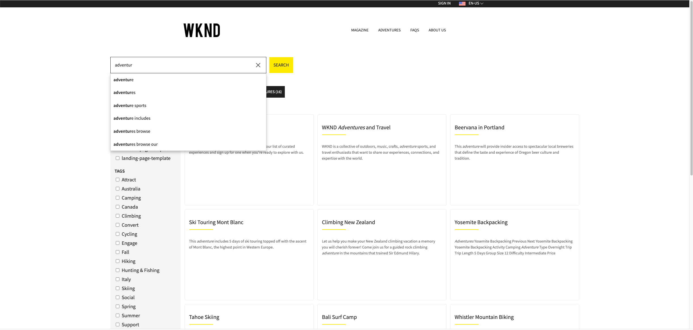
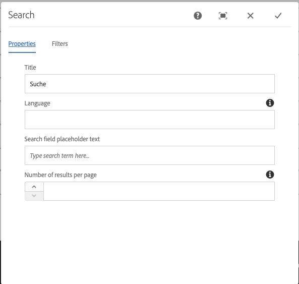
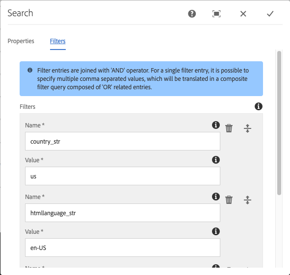

Search
====
Search component with placeholder markup and configs in json format, ready for dynamic markup rendering.

## Features

### Use Object
The Search component uses the `com.valtech.aem.saas.api.fulltextsearch.SearchModel` Sling model as its Use-object.

### Behavior
The user enters search term in the text input field. While typing, user is prompted with autocomplete/typeahead options. On submit, the children search tab components perform a search query and display the results.

### Authoring
This is a container that accepts [Search Tab](../searchtab/README.md) components. It can be included on any page (fix or inside a parsys/responsive-grid). By default, it includes one Search
Tab component.

#### Edit Dialog Properties
The following properties are written to JCR for the Search component and are expected to be available as `Resource` properties:

1. `./title` - Will store the text of the title to be rendered on the top of the component.
2`./language` - Defines the search results language. It overrides the language resolved from resource context.
2. `./searchFieldPlaceholderText` - Defines the text to be displayed as placeholder in the input field. It has a default value defined as i18n entry.
3. `./resultsPerPage` - defines the number of results per page. It overrides the default value of 10 results per page.
4. `./filters` - Defines list of simple search filter entries. The filter entries are joined with a logical 'AND'
   operator.

#### Autocomplete

When requesting the search component resource with a selector: **autocomplete** and extension: **json** (e.g.
/content/saas/us/en/search-page/jcr:content/search.**autocomplete**.**json**), then the search component uses the
typeahead api, to retrieve options for auto complete of the term query (**q**). The search query performed for the
typeahead considers the component's configured filter entries.

#### Search result item tracking

Search Result Items can be boosted by the number of clicks within the Search. A Tracking-API can be enabled to allow for click-tracking of search result items. The API allows to send a POST request to the search component resource with a selector: **tracking** and extension: **json** (e.g. /content/saas/us/en/search-page/jcr:content/search.**tracking**.**json**). The request should be sent with a payload containing the search result item's url (trackedUrl=). Using the TrackingService OSGi component, the url tracking entry is updated in SaaS system.
